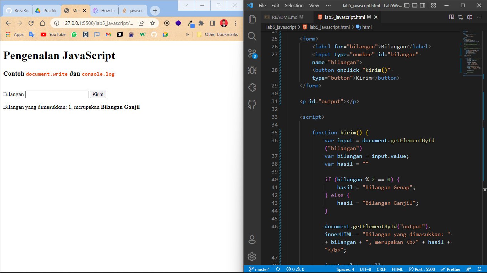
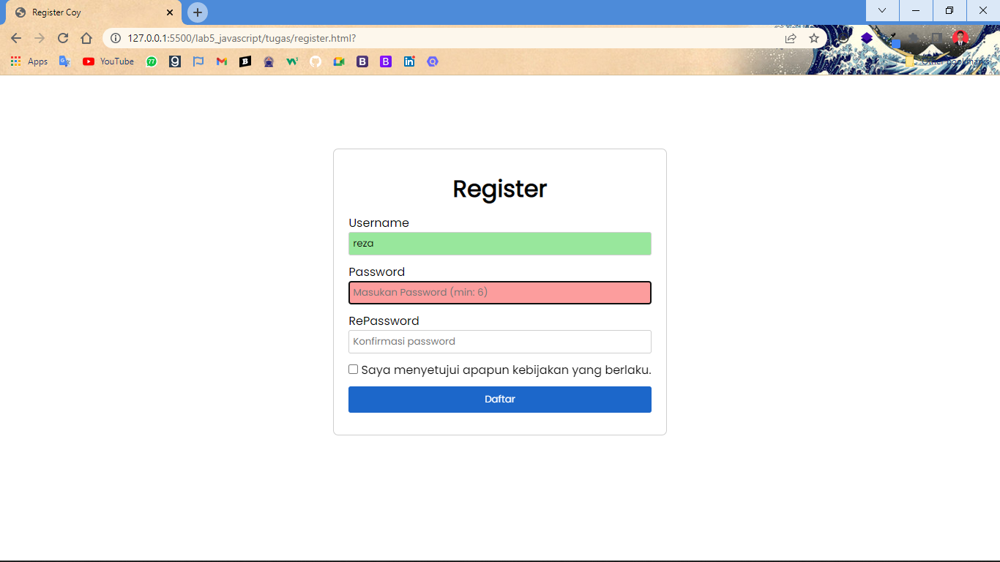

# Tugas Lab 4 Web
## Profil
| #               | Biodata             |
| --------------- | ------------------- |
| **Nama**        | Reza Riyaldi Irawan |
| **NIM**         | 312010284           |
| **Kelas**       | TI.20.A.2           |
| **Mata Kuliah** | Pemrograman Web     |

## Langkah 1 `Persiapan`
1. Buat folder baru bernama `lab5_javascript`.
2. Buat file dengan nama `lab5_javascript.html`.
3. Tambahkan kode berikut.
```html
<!DOCTYPE html>
<html lang="en">

<head>
    <title>Mengenal JavaScript</title>
    <style>
        code {
            color: orangered;
        }
    </style>
</head>

<body>
    <h1>Pengenalan JavaScript</h1>
    <h3>Contoh <code>document.write</code> dan <code>console.log</code></h3>
    <script>
        document.write("Hello World");
        console.log("Hello World");
    </script>
</body>

</html>
```

4. Maka hasilnya akan seperti berikut.


## Langkah 2 `Alert`
1. Tambahkan kode berikut ke dalam tag `<script>`.

```javascript
window.alert("Ini merupakan pesan untuk anda");
```

2. Maka hasilnya akan seperti berikut.


## Langkah 3 `Method dalam object`
1. Tambahkan kode berikut ke dalam tag `<script>`.
2. Tambahkan kode berikut ke dalam tag `<script>`.

```javascript
document.write("Selamat mencoba javascript <br>");
document.write("Semoga Sukses");
```
1. Maka hasilnya akan seperti berikut.


## Langkah 4 `Prompt`
1. Tambahkan kode berikut ke dalam tag `<script>`.

```javascript
var nama = prompt("Siapa nama anda?");
document.write("Hai " + nama);
```

2. Saat dijalankan akan meminta suatu inputan yang nanti akan dimasukan kedalam variable `nama`.


3. Ketika saya menginput nama saya, maka akan tampil seperti berikut.


## Langkah 5 `Function`
1. Buat function `pesan()`.

```javascript
function pesan() {
    alert("Memanggil javascript lewat body onload");
}
```

2. Tambahkan atribut pada tag `<body>`.

```html
<body onload="pesan()">
```

3. Maka ketika web load akan seperti berikut.


## Langkah 6 `Operasi Aritmatika`
1. Buat function `aritmatika()` pada tag `<script>`.

```javascript
function aritmatika(bilangan1, bilangan2) {
    document.write("<b>Penjumlahan : </b><br>" + bilangan1 + " + " + bilangan2 + " = " + (bilangan1 + bilangan2) + "<br><br>")

    document.write("<b>Pengurangan : </b><br>" + bilangan1 + " - " + bilangan2 + " = " + (bilangan1 - bilangan2) + "<br><br>")

    document.write("<b>Perkalian : </b><br>" + bilangan1 + " * " + bilangan2 + " = " + (bilangan1 * bilangan2) + "<br><br>")

    document.write("<b>Pembagian : </b><br>" + bilangan1 + " / " + bilangan2 + " = " + (bilangan1 / bilangan2) + "<br><br>")

    document.write("<b>Modulo : </b><br>" + bilangan1 + " % " + bilangan2 + " = " + (bilangan1 % bilangan2) + "<br><br>")
}
```

2. Buat button dengan menambahkan atribut `onclick`.

```html
<button onclick="aritmatika(9, 4)">Klik function aritmatika 9 dan 4</button>
```

3. Sebelum button diklik.


4. Ketika button diklik.


## Langkah 7 `Kondisi`
1. Tambahkan kode berikut kedalam tag `<script>`.

```javascript
var nilai = prompt("Masukan nilai (0 - 100)");
var hasil= "";

if (nilai < 0 || nilai > 100) {
    alert("Nilai yang anda masukkan tidak valid!")
    location.reload();
} else if (nilai >= 60) {
    hasil = "Lulus";
} else {
    hasil = "Tidak Lulus";
}

document.write("Nilai anda : " + nilai + "<br>");
document.write("Hasil : " + hasil);
```

2. Maka akan meminta inputan 0 - 100.


3. Apabila memasukkan inputan < 0 atau > 100, maka akan seperti berikut.


4. Apabila memasukkan >= 60.


5. Apabila memasukkan < 60.


## Langkah 8 `Switch`
1. Buat function `bilangan()` di dalam tag `<script>`.

```javascript
function bilangan() {
    var bilangan1 = prompt("Input nilai (1 - 5)");
    switch (bilangan1) {
        case '1':
            document.write("Bilangan 1");
            break;

        case '2':
            document.write("Bilangan 2");
            break;

        case '3':
            document.write("Bilangan 3");
            break;

        case '4':
            document.write("Bilangan 4");
            break;

        case '5':
            document.write("Bilangan 5");
            break;

        default:
            document.write("Bilangan lainnya");
            break;
    }
}
```

2. Lalu buat button dengan atribut onclick.

```html
<button onclick="bilangan()">Switch</button>
```

3. Maka hasilnya akan seperti ini.


4. Ketika diklik akan meminta inputan.


5. Apabila yang diinput termasuk kedalam case (1 - 5), akan seperti berikut.


6. Apabila yang diinputkan tidak termasuk kedalam case, akan seperti berikut.


## Langkah 9 `Form Input`
1. Buat form dengan kode seperti berikut.

```html
<form>
    <label for="bilangan">Bilangan</label>
    <input type="number" id="bilangan" name="bilangan">
    <button onclick="kirim()" type="button">Kirim</button>
</form>

<p id="output"></p>
```

2. Tambahkan function `kirim()` untuk memproses hasil.

```javascript
function kirim() {
    var input = document.getElementById("bilangan")
    var bilangan = input.value;
    var hasil = ""

    if (bilangan % 2 == 0) {
        hasil = "Bilangan Genap";
    } else {
        hasil = "Bilangan Ganjil";
    }

    document.getElementById("output").innerHTML = "Bilangan yang dimasukkan: " + bilangan + ", merupakan <b>" + hasil + "</b>";

    input.value = null;
}
```

3. Sebelum menginput akan seperti berikut.


4. Apabila yang dimasukkan bilangan ganjil.



5. Apabila yang dimasukkan bilangan genap.


## Langkah 10 `Form Button`
1. Buat form dengan kode berikut.

```html
<form>
    <button type="button" onclick="ubahWarnaBg('GREEN')">Background Hijau</button>

    <button type="button" onclick="ubahWarnaBg('BLUE')">Background Biru</button>

    <button type="button" onclick="ubahWarnaTeks('YELLOW')">Teks Kuning</button>

    <button type="button" onclick="ubahWarnaTeks('RED')">Teks Merah</button>

    <button type="button" onclick="ubahWarnaDefault()">Default</button>
</form>
```

2. Buat beberapa function agar buttonnya aktif.

```javascript
function ubahWarnaBg(warna) {
    document.bgColor = warna;
}

function ubahWarnaTeks(warna) {
    document.fgColor = warna;
}

function ubahWarnaDefault() {
    document.bgColor = 'WHITE';
    document.fgColor = 'BLACK';
}

document.write("Dimodifikasi terakhir pada " + document.lastModified);
```

3. Hasil akan seperti berikut.


## Langkah 11 `HTML DOM : Perhitungan otomatis`
1. Buat struktur HTML.
2. Buat Form seperti berikut.

```html
<h1>Daftar Menu Makanan</h1>
<form>
    <div class="form-group">
        <label for="ayam">Ayam Goreng <span>Rp. 50.000</span></label>
        <input type="checkbox" value="50000" id="ayam" onclick="hitung(this)">
    </div>

    <div class="form-group">
        <label for="tempe">Tempe Goreng <span>Rp. 10.000</span></label>
        <input type="checkbox" value="10000" id="tempe" onclick="hitung(this)">
    </div>

    <div class="form-group">
        <label for="ikan">Ikan Gurame <span>Rp. 100.000</span></label>
        <input type="checkbox" value="100000" id="ikan" onclick="hitung(this)">
    </div>
</form>
```

3. Tambahkan function untuk menghitung.

```javascript
function hitung(menu) {
    var tot = document.getElementById('total');
    var total = tot.value;
    total = (total ? parseInt(total) : 0);
    var harga = 0;

    if (menu.checked) {
        harga = menu.value;
        total += parseInt(harga);
    } else {
        harga = menu.value;
        if (total > 0) {
            total -= parseInt(harga);
        }
    }

    tot.value = total;
}
```

4. Tambahkan sedikit css.

```css
.form-group {
    display: flex;
    justify-content: space-between;
    background: rgb(215, 215, 240);
    padding: 5px;
    margin: 10px 0;
}

label {
    display: flex;
    width: 100%;
    justify-content: space-between;
}

.form-group:hover {
    background: rgb(170, 170, 194);
}
```

5. Maka hasilnya akan seperti berikut.


## Pertanyaan dan Tugas
1. Buat script untuk melakukan validasi form.

## HTML
```html
<!DOCTYPE html>
<html lang="en">
<head>
    <meta charset="UTF-8">
    <meta http-equiv="X-UA-Compatible" content="IE=edge">
    <meta name="viewport" content="width=device-width, initial-scale=1.0">
    <title>Register Coy</title>

    <!-- CSS -->
    <link rel="stylesheet" href="style.css">
</head>
<body>
    <div class="container">
        <div class="row">
            <div class="card">
                <h1>Register</h1>
                <form>
                    <div class="form-group">
                        <label for="username" class="input">Username</label>
                        <input type="text" id="username" placeholder="Masukan username">
                    </div>
                    
                    <div class="form-group">
                        <label for="password" class="input">Password</label>
                        <input type="password" id="password" placeholder="Masukan Password (min: 6)">
                    </div>

                    <div class="form-group">
                        <label for="repassword" class="input">RePassword</label>
                        <input type="password" id="repassword" placeholder="Konfirmasi password">
                    </div>

                    <div class="form-group">
                        <input type="checkbox" id="agree">
                        <label for="agree">Saya menyetujui apapun kebijakan yang berlaku.</label>
                    </div>

                    <button id="button">Daftar</button>
                </form>
            </div>
        </div>
    </div>

    <script src="script.js"></script>
</body>
</html>
```

## CSS
```css
@import url('https://fonts.googleapis.com/css2?family=Poppins&display=swap');
* {
    padding: 0;
    margin: 0;
    font-family: 'Poppins', sans-serif;
}

.container {
    width: 100%;
    display: flex;
    justify-content: center;
    padding-top: 100px;
}

.card {
    /* background-color: grey; */
    display: flex; 
    justify-content: center;
    align-items: center;
    flex-direction: column;
    padding: 30px 20px;
    border: 1px rgb(207, 207, 207) solid;
    border-radius: 7px;
}

.form-group {
    margin: 10px 0;
}

label.input, input[type="text"], input[type="password"] {
    display: block;
    width: 100%;
    box-sizing: border-box;
}

input {
    padding: 5px;
    border: 1px solid rgb(207, 207, 207);
    border-radius: 3px;
}

button {
    background-color: rgb(28, 103, 202);
    border: none;
    padding: 8px 20px;
    width: 100%;
    border-radius: 3px;
    color: white;
}

button:hover {
    background-color: rgb(13, 89, 189);
    cursor: pointer;

}

```

## Javascript
```javascript
var username = document.getElementById("username");
var password = document.getElementById("password");
var repassword = document.getElementById("repassword");
var check = document.getElementById("agree");
var button = document.getElementById("button");

username.onfocus = function () {
	if (username.value == "") {
		username.style.backgroundColor = "#fc9d9d";
	} else {
		username.style.backgroundColor = "#98e79c";
	}
};

username.onkeyup = function () {
	username.style.backgroundColor = "#98e79c";
};

username.onblur = function () {
	if (username.value != "") {
		username.style.backgroundColor = "#98e79c";
	} else {
		username.style.backgroundColor = "#fc9d9d";
	}
};

password.onfocus = function () {
	if (password.value == "") {
		password.style.backgroundColor = "#fc9d9d";
	}
};

password.onkeyup = function () {
	if (password.value.length >= 6) {
		password.style.backgroundColor = "#98e79c";
	} else {
		password.style.backgroundColor = "#fc9d9d";
	}
};

password.onblur = function () {
	if (password.value != "" && password.value.length >= 6) {
		password.style.backgroundColor = "#98e79c";
	} else {
		password.style.backgroundColor = "#fc9d9d";
	}
};

repassword.onfocus = function () {
	if (repassword.value == "") {
		repassword.style.backgroundColor = "#fc9d9d";
	}
};

repassword.onkeyup = function () {
	if (repassword.value.length >= 6 && password.value == repassword.value) {
		repassword.style.backgroundColor = "#98e79c";
	} else {
		repassword.style.backgroundColor = "#fc9d9d";
	}
};

repassword.onblur = function () {
	if (repassword.value != "" && repassword.value.length >= 6) {
		repassword.style.backgroundColor = "#98e79c";
	} else {
		repassword.style.backgroundColor = "#fc9d9d";
	}
};

button.onclick = function () {
	if (
		check.checked &&
		username.value != "" &&
		password.value != "" &&
		password.value.length >= 6 &&
		password.value === repassword.value
	) {
		alert("Berhasil mendaftar");
	} else {
        alert("Gagal mendaftar harap cek semua inputan form");
	}
}

```

## Running
1. Tampilan awal


2. Mengisi inputan dengan benar, dan tidak kosong



3. Apabila salah satu belum terpenuhi


4. Jika semua terpenuhi

